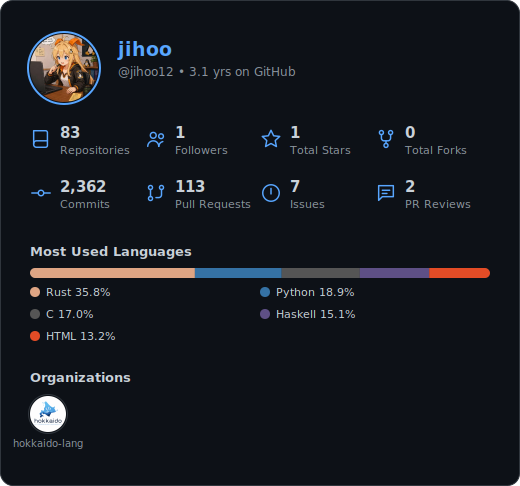
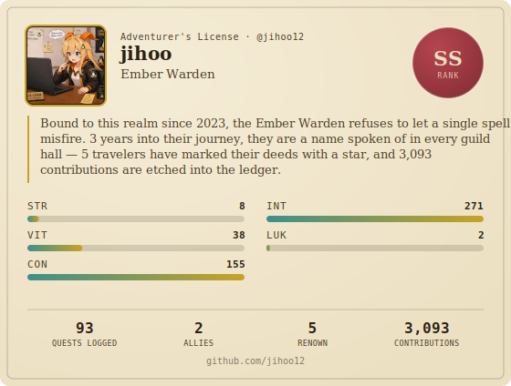

  

---

### 📊 GitHub Stats

<table border="0">
    <tr>
    <td align="center">
      
    </td>
    <td align="center">
      
    </td>
  </tr>
</table>

<table border="0">
  <tr>
    <td colspan="2" align="center">
      
    </td>
    <td colspan="2" align="center">
      
    </td>
  </tr>
</table>

---

### 🐾 My Contribution Farm

  

---

### 🏆 Trophies

  <picture>
    <source media="(prefers-color-scheme: dark)" srcset="https://github-trophies.vercel.app/?username=jihoo12&theme=radical&no-frame=true" />
    <source media="(prefers-color-scheme: light)" srcset="https://github-trophies.vercel.app/?username=jihoo12&no-frame=true" />
    
  </picture>

---

profile views count
 

