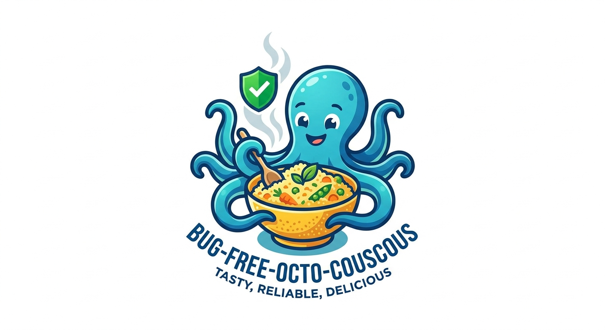

# Hi, I'm Jihoo 👋
- i'm a freshman at korea polytechnics at AI software department
- i use nixos
- i use doom emacs & vim & vscode

## Interests
- dependently typed language
- cubical-agda
- haskell
- Homotopy Type Theory
- linux
- org mode
- AI

## 😃
- i like AI
- i like make something cool
## i'm member of bug-free-octo-couscous

## timezone Asia/seoul UTC+9
